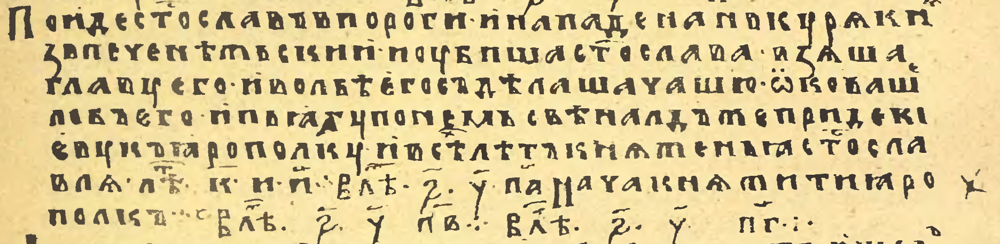
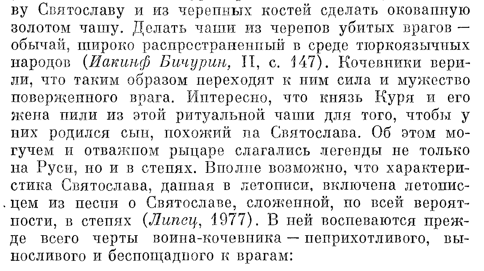

# Old school сводит скулы

Всем маломальски интересующимся отечественной истории хорошо известен случай из "Повести временных лет" [о гибели князя Святослава Игоревича](https://ru.wikipedia.org/wiki/%D0%A1%D0%B2%D1%8F%D1%82%D0%BE%D1%81%D0%BB%D0%B0%D0%B2_%D0%98%D0%B3%D0%BE%D1%80%D0%B5%D0%B2%D0%B8%D1%87#%D0%93%D0%B8%D0%B1%D0%B5%D0%BB%D1%8C). Возвращаясь в конце 971 г. из похода на Византию, он с войском стал лагерем в низовьях Днепра. Воины смогли продолжить свой путь домой только с наступлением весны. У порогов на них напали печенеги, не только разгромившие русов, но и убившие самого Святослава. Из черепа князя хан Куря приказал сделать окованную металлом чашу.

Этот хрестоматийный сюжет вспомнился мне при чтении «Истории Флоренции» Никколо Макиавелли. Там тоже описывается, как пиршественная чаша была изготовлена из черепа побежденного врага, когда лангобарды разгромили гепидов. Затем я прочитал «Историю лангобардов» Павла Диакона и обнаружил там тот же сюжет. По сравнению с русскими летописями, в этих двух источниках есть интересный нюанс: король-победитель Альбоин не ограничился в унижении врагов изготовлением чаши из черепа их лидера. Он женился на дочери побежденного Розамунде, да еще и заставил ее пить из той самой чаши. Это, конечно же, спровоцировало месть: Розамунда спланировала и осуществила убийство Альбоина. Читая об этом, кстати, нельзя не вспомнить о деяниях таких библейских героинь, как Юдифь, Далила, Саломея. Они тоже так или иначе связаны с отрубленными головами или, в случае Далилы, остриженными волосами, в которых была заключена сила Самсона (тоже своего рода обезглавливание).

Оказалось, что в Википедии есть [целая статья](https://ru.wikipedia.org/wiki/%D0%A7%D0%B0%D1%88%D0%B0_%D0%B8%D0%B7_%D1%87%D0%B5%D1%80%D0%B5%D0%BF%D0%B0), посвященная такого рода инцидентам. Из нее я узнал удивительную подробность. Оказывается, хан Куря тоже пил вино из святославова черепа вместе с женой. Меня так заинтриговала эта цепочка совпадений, что я написал [программу](https://github.com/yababay/historical-prolog/tree/001-add-skull-goblet) на языке `Prolog`, сопоставляющую эти факты. Вот что она выдает о победе лангобардов над гепидами: 

* **Павел Диакон** в «Истории лангобардов» сообщает следующее. Однажды  лангобарды под предводительством короля Альбоина победили гепидов. Он велел изготовить кубок из черепа лидера побежденных - короля Кунимунда. На пиру он пил из этого кубка со своей женой Розамундой.
* **Никколо Макиавелли** в «Истории Флоренции» сообщает следующее. Однажды  лангобарды под предводительством короля Альбоина победили гепидов. Он велел изготовить кубок из черепа лидера побежденных - короля Гунимунда. На пиру он пил из этого кубка со своей женой Розамундой.
* **Лудовико Антонио Муратори** в «Анналах Италии» сообщает следующее. В 556 г.  лангобарды под предводительством короля Альбоина победили гепидов. Об изготовлении кубка из черепа применительно к этому столкновению этот источник не сообщает. Пир также не упоминается.

Подчеркиваю, что это текст, сгенерированный компьютерой программой, исходный код которой я открыл для всеобщего доступа, проверки и критики (см. ссылку выше). 

Здесь обращает на себя внимание, во-первых, небольшая разница в именах побежденных. У Макиавелли короля зовут Гунимунд, у Павла Диакона - Кунимунд. Казалось бы, ничего особенного, разница в одной букве простительна. Оба автора хоть и жили в Италии, но времена их жизней разделяет почти тысяча лет. Но если мы поищем в Википедии эти два имени собственных, то выяснится, что [Кунимунд](https://ru.wikipedia.org/wiki/%D0%9A%D1%83%D0%BD%D0%B8%D0%BC%D1%83%D0%BD%D0%B4) это действительно король разгромленных лангобардами гепидов, а вот [Гунимунд](https://ru.wikipedia.org/wiki/%D0%93%D1%83%D0%BD%D0%B8%D0%BC%D1%83%D0%BD%D0%B4) - совсем другое историческое лицо. Так звали короля остготов, жившего за полтора столетия до событий с чашей-черепом. Казалось бы, повторяющиеся имена королей не должны смущать исследователей, но "осадочек" у представителей критического направления, к которому я себя отношу, не может не оставаться. Ведь короли с совпадающими именами обычно нумеруются, т.е. должны бы быть Гунимунд I, Гунимунд II, но в нашем случае имена остготского и гепидского королей полностью совпадают. К тому же принадлежат они к довольно близким германским племенам. Напрашивается мысль о вероятности того, что за этими персонажами скрывается одна и та же личность.

Есть над чем задумалься и при анализе имени Альбоин. В упомянутой статье Википедии про чаши-черепа сообщается, что еще Тит Ливий описывал церемониальное использование таковых у кельтского племени бойев. Бойи жили в Италии примерно там же, где и лангобарды, только, по официальной версии, лет на 700 раньше. А ведь имя Альбоин легко раскладывается на "аль" - неопределенный артикль и "боин" - представитель народа бойев, т.е. можно перевести как "один из бойев". Если предположить, что вся эта история про Альбоина, Гинимунда/Кунимунда (="мир гуннов") и Розамунду (="роза мира") сфальсифицирована, то можно подумать, что за многократно использованным, растиражированным применительно к разным народам сюжетом кроется какое-то изначальное событие, подробности которого нам не сообщаются. И да, при подготовке этой статьи у меня, как и у многих читателей при чтении, в голове зазвучала песенка [Rosamunda](https://en.wikipedia.org/wiki/Beer_Barrel_Polka). А если еще не зазвучала, то сейчас зазвучит. Всегда пожалуйста.

Сгенерированный компьютером список фактов содержит дополнительный пункт, не связанный ни с книгой Микавелли, ни с хроникой Павла Дьякона. Там упоминается Лудовико Муратори, итальянский историк первой половины XVIII в. Он в свое время проделал огромную работу по систематизации историографии своей страны. Сейчас его книги малодоступны. Я смог найти лишь неоцифрованный латинский текст. "Приплел" же я Муратори к анализу этого сюжета потому, что он, умерший в 1750 г., в отличие от Павла Диакона, умершего примерно в 799 г. и Никколо Макиавелли, умершего в 1527 г., **знал точную датировку битвы лангобардов с гепидами**! Они не знали (по крайней мере не приводят), а он знал. Это не редкость в мире официальной истории: кто позднее живет, тот и "лучше знает, как было на самом деле". Думаю, про изготовление кубка из черепа (Г/К)унимунда Муратори тоже знал, но переводить его труды с латыни я не берусь, поэтому ввел в свою программу данные о том, что этот историограф об такой чаше не упоминает. Главное для нас - что он знает датировку с точностью до года. Интересно и то, что Муратори писал свои труды на латыни, а Макиавелли на итальянском, хотя логичнее было бы наоборот. Если всё это сфальсифицировано, то напрашивается вывод о том, что именно во времена Муратори и формировалась официальная хронология. Да и латинский язык, возможно, сконструирован тогда же.

***

Обратимся теперь к второй "порции" фактов - об изготовлении по приказу печенежского хана Кури чаши из черепа князя Святослава. 

* **Лев Диакон** в «Истории» сообщает следующее. Однажды  пацинаки (имя и титул их лидера не упоминаются) победили русов. Об изготовлении кубка из черепа применительно к этому столкновению этот источник не сообщает. Пир также не упоминается.
* **Нестор** в «Повести временных лет» сообщает следующее. В 6480 г.  печенеги под предводительством князя Кури победили русов. Он велел изготовить кубок из черепа лидера побежденных - князя Святослава. Пир также не упоминается.
* **Светлана Плетнёва** в монографии «Половцы» сообщает следующее. В 972 г.  печенеги под предводительством хана Кури победили русов. Он велел изготовить кубок из черепа лидера побежденных - князя Святослава. На пиру он пил из этого кубка со своей женой, имя которой не сохранилось.

Самым ранним из официальных источников по этому вопросу является хроника Льва Диакона. (Кстати, одного меня удивляет, что на почве интереса к кубкам-черепам в этой моей статье  встретились Павел Диакон и Лев Диакон, жившие с разницей лет в 100?) В ней не сообщается ни дата столкновения, ни имя и титул лидера кочевников, да и сами они названы не печенегами, а **пацинаками** (так и хочется сказать "четкими пацанчиками", потому что занимались примерно тем же, что и наши гопники в 1990-е, т.е. рэкетом). Имя Святослав, кстати, тоже фигурирует у Льва Диакона не в привычном варианте, а как Сфендослав. Об изготовлении чаши из княжьего черепа в этой хронике ничего не сказано, зато, конечно же, есть сноска, где современные отечественные историки не упустили случая напомнить: "Да это же тот самый случай, описанный в наших летописях!"  (Далее следует краткий пересказ всё того же нечестивого деяния).

Действительно, в «Повести временных лет», изданной в 2012 г. по лаврентьевскому списку 1377 г. в переводе Д.С. Лихачева, сказано так:

> В год 6480 (972), когда наступила весна, отправился Святослав к порогам. И напал на него Куря, князь печенежский, и убили Святослава, и взяли голову его, и сделали чашу из черепа, оковав его, и пили из него.

Обратим внимание на это бесцеремонное "(972)". Это пересчет из летоисчисления от сотворения мира в летоисчисление от Рождества Христова. Такие примечания обычно пишут на полях или в сносках, но здесь складывается впечатление, что сам летописец Нестор позаботился о своих читателях: вот, мол, кому как удобно, оба варианта даты привожу. А ведь это издание позиционируется как эталонное, престижное, малотиражное, в котором даже экземпляры пронумерованы, а часть тиража оснащена кожаными переплетами, золочеными обрезами и чуть ли не вручную нарисованными иллюстрациями. А с научной точки зрения - лажа. Но не это главное. Главное, что сам Нестор (или тот, что за него себя выдавал) приводит датировку события в "допетровском формате" 6480 г. А если еще честнее, то датировку приводят издатели, а у самого Нестора вот что:

 Это фрагмент из репринта 1871 г. Я смог разобрать здесь такое содержание:

> Пойде Святослав до пороги и нападе на него Куря князь печенежский. Поубиша Святослава, взяша главу его. Изо лбе его соделаша чашу. Оковаше лоб его.

Всё, больше здесь ничего, относящегося к нашему сюжету, не сказано. Дальше говорится  уже о вокняжении Свенольда. Куря здесь назван не ханом (как в Википедии), а князем печенегов, абзац не начинается с датировки (она выше, в конце предыдущего), да и фразы "пили из него" нет, но современные ученые, конечно же, лучше знают, "как было на самом деле". Впрочем, «Повесть временных лет» существует во множестве вариантов, так что парой  слов абзацы, конечно же, могут различаться.

Но тут, как и в случае с лангобардами, к дуэту старинных историков присоединяется некто из новых времен. На этот раз даже из новейших. Это С.А. Плетнева, специалист по степным сообществам Средневековья. Она уже тоже ушла в мир иной, но это, при всем уважении, не должно стать препятствием, для критического анализа ее текста. В своей  монографии «Половцы» исследовательница обнаруживает у хана Кури жену, с которой они на пирах пьют вино из кубка, изготовленного из черепа Святослава. И не для забавы: по поверью кочевников, пить из черепов павших вражеских богатырей нужно для того, чтобы будущие дети были крепче:

С чего она это взяла?! Ни одной ссылки (Липсец, 1977 и Иакинф Бичурин, II, С 147 здесь иллюстрируют совсем другие мысли) не приводится. Получается, что факт о жене Кури, разделявшей его ритуальные трапезы - вымысел даже не средневекового, а современного историка. Происхождение этого "факта" лет через 10 забудется, и он превратится в "достоверность". А ведь на этот-то вымысел уже делаются ссылки! Википедия ссылается в [статье о печенежском хане Куре](https://ru.wikipedia.org/?curid=339677&oldid=125495325) на работу Плетневой, а работа Плетневой ведет... в пустоту. И вот на таком материале зиждется официальная версия истории.

В качестве бонуса - еще одно интересное наблюдение. Помните, как в начале статьи Гунимунд, "распался" на остготского короля начала V в. и на гепидского VI в.? Так вот хан, Куря тоже "раздвоился". Есть вышеупомянутый печенежский хан Куря, современник Святослава Игоревича, а есть еще половецкий хан Куря, современник князя Игоря, про которого "Слово о полку...". И это тоже как бы не должно вызывать вопросов... Перефразируя донну Розу Дальвадорец, говаривавшую, что, мол, мало ли в Бразилии Педров, можно сказать: "Да мало ли Курь гонялось за Гунимундами по необъятным степям Евразии!" Но официальные-то историки, как мы видели, точно знают, кто из них правильный Куря и правильный Гунимунд. 

